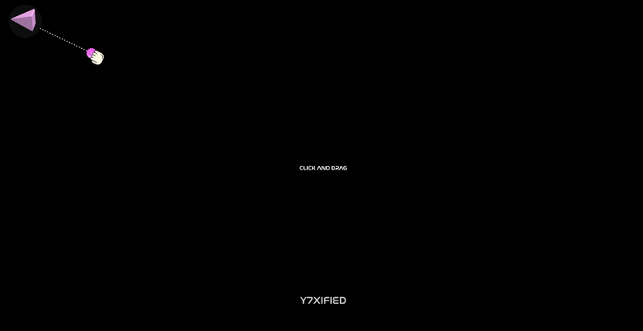

<h1 align="center">FLAIR CONFETTI</h1>

[](https://flair-confetti.vercel.app/)
[](https://github.com/Y7XIFIED/flair-confetti/stargazers)
[](https://opensource.org/licenses/ISC)


## 📖 About

* **Tactile Cannon Controls:** Click, hold, and pull back the hand launcher to aim.
* **Dynamic Web Audio SFX:** Real-time pitch-bending tension stretch and release pop sounds.
* **Custom Physics Simulation:** Gravity, boundary collisions, elastic bounces, and viewport shakes.


## 🛠️ Features

| Feature | Description | Implementation Details |
| :--- | :--- | :--- |
| **Tactile Sling Controller** | Interactive click-and-drag tension anchor with dynamic visual feedback. | Uses GSAP `Observer` for unified pointer inputs. |
| **Procedural Audio Synthesis** | Pitch-bent stretch feedback and release pop sound effects. | Built with native `AudioContext` triangle/sine oscillators. |
| **Custom Physics Loop** | Euler integration for gravity, boundary collision, and ground friction. | Hooks into `requestAnimationFrame` via the GSAP ticker. |


## 🖼️ Preview




## 🚀 Live Application

The final interactive web application is deployed and available to use:  
**[flair-confetti.vercel.app](https://flair-confetti.vercel.app/)**


## 🎮 How to Control

* **Pull & Launch:** Click, hold, and pull back the hand icon. Watch the line stretch and listen to the pitch rise, then let go to launch the blast.
* **Mobile Taps:** Open the page on a mobile device and tap anywhere to trigger instant explosions without needing to drag.


## ⚙️ Installation

### Prerequisites

* **Node.js** (v18.0.0 or higher recommended)
* **npm** (v9.0.0 or higher)

### Setup Instructions

1. Clone the repository:
   ```bash
   git clone https://github.com/Y7XIFIED/flair-confetti.git
   cd flair-confetti
   ```
2. Install the package dependencies:
   ```bash
   npm install
   ```
3. Start the Vite development server:
   ```bash
   npm run dev
   ```


## 📂 Project Structure

```text
├── assets/
│   └── fonts/
│       └── Nasalization Rg.otf
├── index.html
├── main.css
├── main.js
├── package.json
└── vercel.json
```


## 💻 Tech Stack

<p align="center">
  <a href="https://skillicons.dev">
    
  </a>
</p>

* **HTML5 & CSS3:** Structural vectors and custom styling variables.
* **JavaScript (ES6):** Unified pointer events and Web Audio API synthesis.
* **GSAP Core:** High-performance animation engine and observer utilities.
* **Vite:** Next-generation frontend project bundler.


<div align="center">
  <p>If you find this simulation inspiring, please give it a ⭐ on GitHub!</p>
</div>
